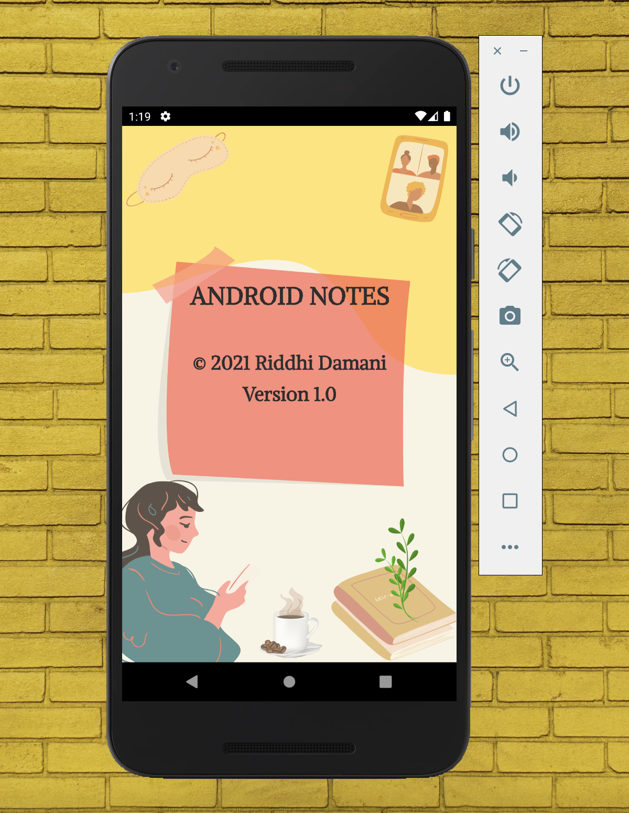

# Android_Notes_App
Android Notes app allows the creation and maintenance of personal notes. Any number of notes are allowed (including no notes at all). 
Notes are made up of a title, a note text, and a last-update time. This app uses RecyclerView, Multi-Activity, JSON file, and 
Options-Menus. This app has been built under the guidance of Prof. Christopher Jones as a part of CSC 472 coursework. 

Notes is saved to (and loaded from) the internal file system in JSON format. If no file is found upon loading, 
the application starts with no existing notes and no errors. (A new JSON file would then be created when new notes are saved).

JSON file loading happens in the onCreate(). Saving happens whenever a new note is added or a note is deleted.

A Note class (with title, note text, and last save date) is created to represent each individual note in the application.

The application is made up of 3 activities. These are described below:
1) Main Activity :
   Notes are displayed in a list, in time order (latest-update-first, oldest update- last). The note list is 
   implemented using the RecyclerView. The Main Activity allows the user to create a new note via an Add options
   menu item. It also has an Info options-menu item. 
2) Edit Activity :
   The Edit Activity contains editable fields for the note title and note text. The last-save time is NOT displayed here 
   and is never user-editable – it is automatically generated and saved when the note is saved.
3) About Activity :
   The About Activity contains a full-screen image background (designed by me using Canva). Over the background image, key 
   information on the application is displayed. This information includes the application title, a copyright date and 
   my name, and the version number (1.0). There is no functionality present on this activity. The only action a user 
   takes is press the Back arrow to exit the activity.

Emulator Devices used for testing: 
    Emulator used: Nexus 5X | Resolution: 1080 x 1920 | Details: With Playstore

## Screenshots:

1. Portrait Orientation (Primary)

    
2. Landscape Orientation

